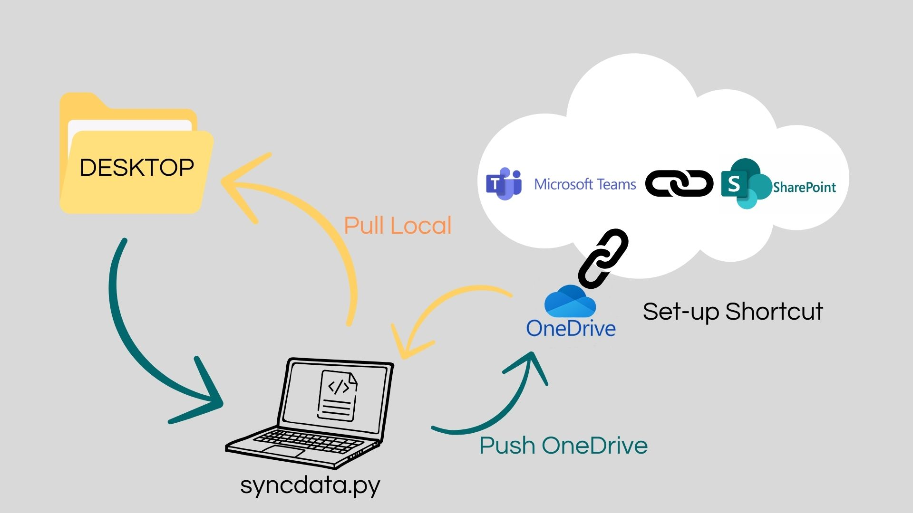
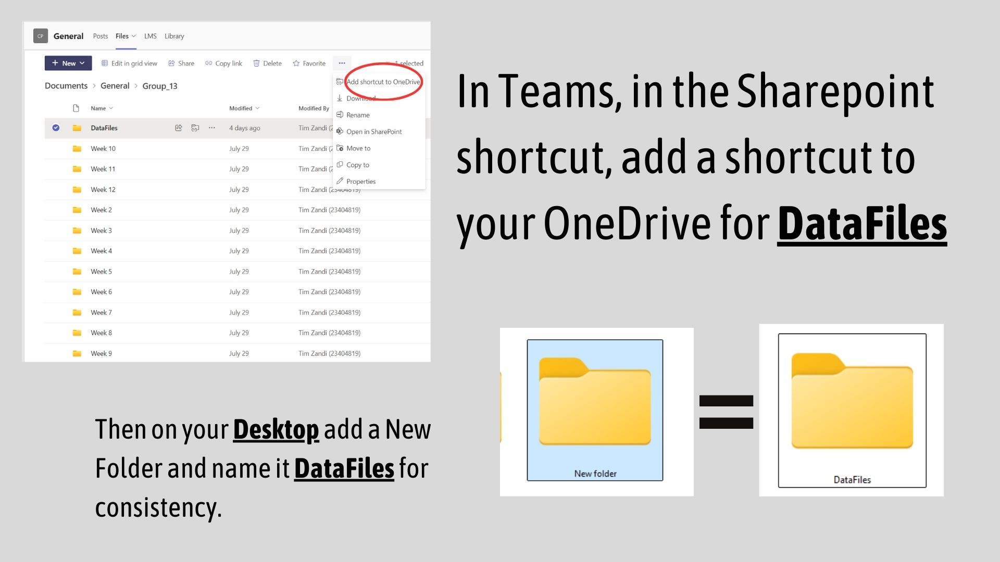
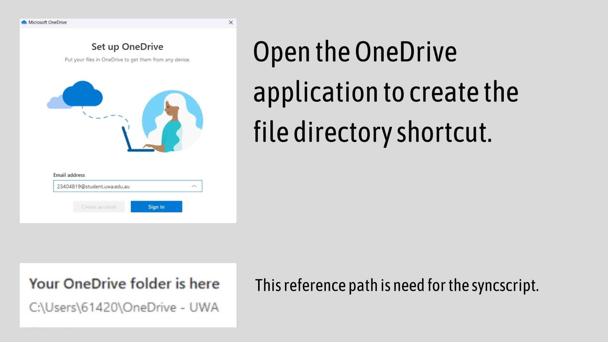
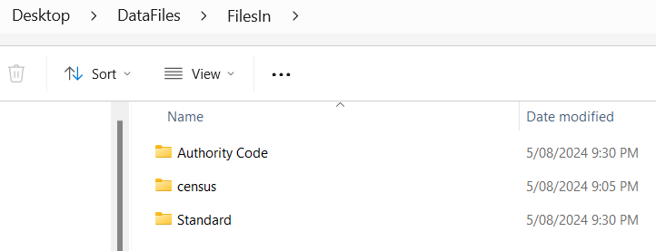

# CITS3200---National-Housing-Simulation

National Housing Simulation - mapping data points from the G-NAF and the census data sets.

## Install

Currently, two methods are supported. `poetry` is the main method for managing Python dependencies. `devbox` uses `poetry` to manage Python dependencies but provide extra isolation from your host environment and automates some of the processes when used with `direnv`. It can also manage non-Python dependencies as well without installing it on your main machine.

### Poetry

[Poetry](https://python-poetry.org/) is a Python dependency manager. Install it following the [official guide](https://python-poetry.org/docs/#installing-with-the-official-installer).

```bash
poetry install   # Install the dependencies from pyproject.toml
poetry shell     # Activate the virtual environment
```

## Devbox + direnv

**Warning: `direnv` allow any arbitrary bash commands to be executed, please inspect `.envrc` before allowing direnv!**

[Devbox](https://github.com/jetify-com/devbox) is used to create isolated development shells where the dependencies are declared in `devbox.json` file and are version-locked in `devbox.lock`. Dependencies and programs installed in the shell are only accessible in the shell. It is internally powered by Nix where the list of Nix packages can be found at [Nixhub.io](https://www.nixhub.io/).

[`direnv`](https://github.com/direnv/direnv) is used to extend the current shell by loading and unloading environmental variables automatically as the user enters the current directory. This is used to activate the Devbox shell automatically using the `.envrc` file.

First, install both [Devbox](https://www.jetify.com/devbox/docs/installing_devbox/) and [`direnv`](https://github.com/direnv/direnv). Then, from the top-most directory of the project, run the following command.

```bash
direnv allow    # Allow direnv to execute .envrc
```

When you `cd` into the directory, Devbox will install the required dependencies locally, run poetry to install the requirements, and activate the virtual environment automatically.

## Accessing Data from Sharepoint Host

The goal of hosting the data in a centralised platform is to prevent risk of data loss and to maintain the integrity of the data that we can all reference as one source of truth, while encouraging testing and the associated errors.

As shown below, a shortcut to Sharepoint from Teams need to be saved on your Desktop, so the syncscript is consistent and able to run across all operating systems (including Mac & Linux).







The syncing process is done as shown below, note my directory is on my Desktop too by coincidence - that is not important:

```bash
pip install dirsync

PS C:\Users\61420\Desktop\CITS3200---National-Housing-Simulation> python syncdata.py

Please enter your Windows username: 61420

Please enter your OneDrive name (e.g., OneDrive - UWA): Onedrive - UWA
```

**_ PLEASE ADD HOW THIS WOULD BE DONE IN POETRY OR DEVBOX, I AM NOT FAMILIAR WITH HOW THE WORKFLOW THEY COMBINE WITH _**

Ensure the syncscript works for your workflow, it will NOT be tracked for updates and contained in the “.gitignore”



The Sharepoint files will then be loaded to the local copy, which took 40 minutes for 3.4GB of input data.
